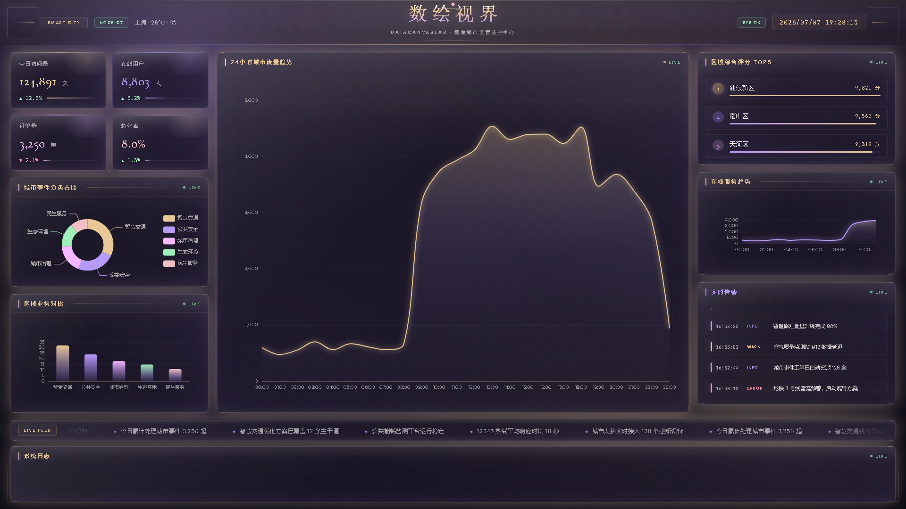
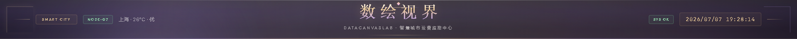
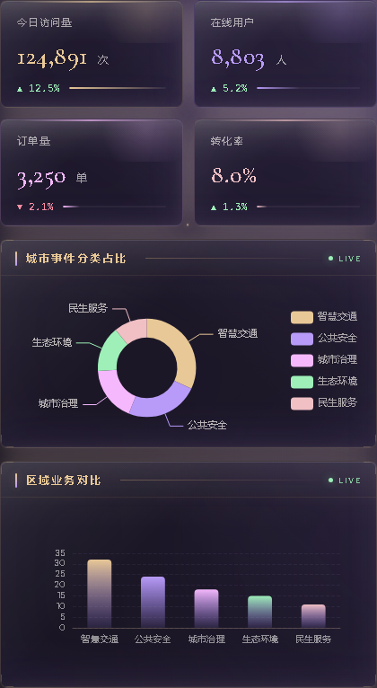
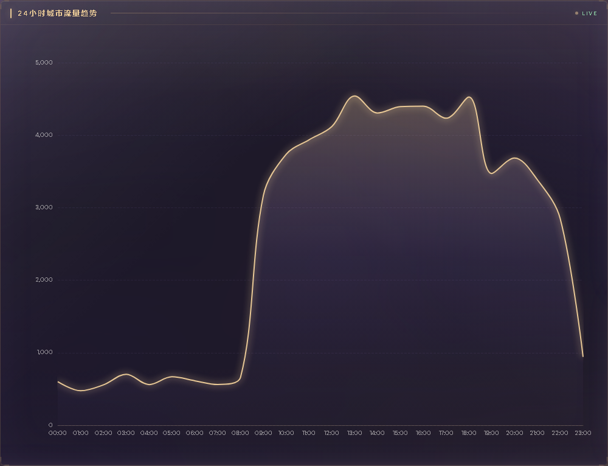
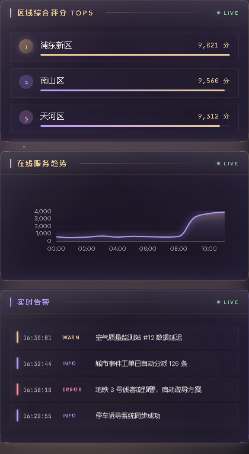
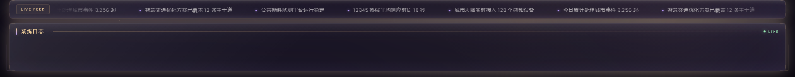

# DataCanvasLab

> **数绘视界** — 面向零基础学习者的数据可视化大屏开源项目，从 0 到 1 自己动手打造数据可视化大屏。

<p align="center">
  
  <br />
  <em>智慧城市运营监控大屏 · Obsidian Aurora 主题 · 1920×1080 设计稿</em>
</p>

---

## 项目简介

**DataCanvasLab（数绘视界）** 是一个公开的教学型数据大屏项目，采用 **Vue 3 + TypeScript + ECharts** 技术栈，内置 Mock 数据、日志系统、模块化架构，适合学习、教学与二次开发。

| 特性 | 说明 |
|------|------|
| 视觉 | **Obsidian Aurora** 高级暗色主题 — 玫瑰金 + 紫罗兰配色，玻璃态面板 + 动态极光背景 |
| 动效 | 极光漂移、流动网格、扫光、漂浮粒子、星点闪烁等多层背景动画 |
| 数据 | Mock 数据开箱即用，支持切换真实 API |
| 架构 | Adapter 模式 + Pinia + 业务模块分层 |
| 工程 | Vitest 单元测试 + ESLint + Playwright 自动化截图 |

---

## 界面预览

### 顶部标题栏

实时时钟、城市标签、系统状态芯片，Cormorant Garamond 衬线主标题 + 玫瑰金渐变高光。

<p align="center">
  
</p>

### 左侧 · 概览区

KPI 数字卡片（顶部高光线 + 柔光层）、分类占比饼图、区域业务柱状图。

<p align="center">
  
</p>

### 中央 · 核心趋势

24 小时城市流量趋势大图，玫瑰金主题强调主视觉。

<p align="center">
  
</p>

### 右侧 · 排行与告警

区域综合评分 Top5（进度条）、在线服务趋势、实时告警滚动列表。

<p align="center">
  
</p>

### 底部 · 数据滚动与系统日志

实时数据 ticker + 分级日志面板（Console + MemoryTransport）。

<p align="center">
  
</p>

---

## 视觉设计

当前版本采用 **Obsidian Aurora（黑曜石极光）** 设计语言：

| 元素 | 说明 |
|------|------|
| 主色 | 玫瑰金 `#e8c896` — 标题、KPI、图表主线 |
| 辅色 | 紫罗兰 `#b89bf8`、淡粉紫 `#f5b8fc` — 图表、排行、告警 |
| 背景 | 多层极光光斑 + 流动网格 + 扫光 + 28 个漂浮粒子 |
| 面板 | 毛玻璃质感，顶部白色高光 + 内发光边框 |
| 字体 | Cormorant Garamond（标题）/ DM Sans（正文）/ JetBrains Mono（数据） |

背景动效由 `ScreenBackdrop.vue` 实现，纯 CSS 动画，无额外依赖。

---

## 适合谁学

- 想从零了解 **数据可视化大屏** 开发的初学者
- 需要带学生做 **0→1 实战项目** 的老师
- 希望自己动手做一个可展示、可扩展大屏的开发者

---

## 快速开始

### 环境要求

- Node.js 18+
- npm 9+

### 安装与运行

```bash
git clone https://github.com/zhu-zhu-zhu-zhu/DataCanvasLab.git
cd DataCanvasLab
npm install
npm run dev
```

浏览器访问：**http://localhost:5173**

### 常用命令

```bash
npm run dev              # 本地开发
npm run build            # 生产构建
npm run test             # 单元测试
npm run lint             # 代码检查
npm run preview          # 预览构建结果
npm run screenshot       # 自动化截图（更新 README 配图）
```

### Mock / API 切换

在 `.env.development` 中：

```env
VITE_USE_MOCK=true   # 使用 Mock 数据（默认）
VITE_USE_MOCK=false  # 切换为 HttpAdapter 真实 API
```

---

## 自动化截图

项目内置 Playwright 截图脚本，用于生成 README 配图与文档素材。

```bash
# 首次使用需安装 Chromium
npm run screenshot:install

# 构建（mock 模式）+ 启动预览 + 自动截图
npm run screenshot
```

截图输出目录：`docs/assets/`

| 文件 | 内容 |
|------|------|
| `01-dashboard-full.png` | 大屏全貌 |
| `02-header.png` | 顶部标题栏 |
| `03-overview-panel.png` | 左侧概览 |
| `04-center-trend.png` | 中央趋势图 |
| `05-ranking-alerts.png` | 右侧排行告警 |
| `06-footer-logs.png` | 底部日志区 |
| `00-browser-viewport.png` | 浏览器视口 |

> 修改 UI 后运行 `npm run screenshot` 即可刷新图文文档配图。

---

## 项目结构

```
DataCanvasLab/
├── docs/
│   ├── assets/          # 自动化截图输出
│   └── AI-Build-Prompt.md
├── scripts/
│   └── capture-screenshots.mjs
├── src/
│   ├── api/             # Axios + Adapter（Mock / HTTP）
│   ├── charts/          # ECharts 图表封装
│   ├── components/      # 通用 UI + 特效（ScreenBackdrop 等）
│   ├── composables/     # 轮询、大屏缩放
│   ├── core/logger/     # 分级日志系统
│   ├── layouts/         # 大屏布局
│   ├── modules/         # 业务模块
│   ├── mock/            # Mock 数据
│   ├── services/        # 业务服务层
│   ├── stores/          # Pinia 状态
│   ├── styles/          # 全局 SCSS 主题变量
│   └── views/           # 页面组装
└── README.md
```

---

## 架构说明

```
┌─────────────┐     ┌──────────────────┐     ┌─────────────────┐
│  View 层    │ ──▶ │  Service 层       │ ──▶ │  Adapter 层      │
│ DashboardView│     │ dashboard.service│     │ Mock / Http      │
└─────────────┘     └──────────────────┘     └─────────────────┘
        │                                              │
        ▼                                              ▼
┌─────────────┐                               ┌─────────────────┐
│  Pinia Store│                               │  Mock 数据 / API │
└─────────────┘                               └─────────────────┘
        │
        ▼
┌─────────────┐
│  Logger     │ ──▶ 控制台 + 大屏日志面板
└─────────────┘
```

---

## 参与贡献

欢迎通过 Issue 和 Pull Request 参与项目共建。提交 UI 变更时，请运行 `npm run screenshot` 同步更新 `docs/assets/` 配图。

---

## License

MIT License — 详见 [LICENSE](LICENSE)

Copyright (c) 2026 zhu-zhu-zhu-zhu
